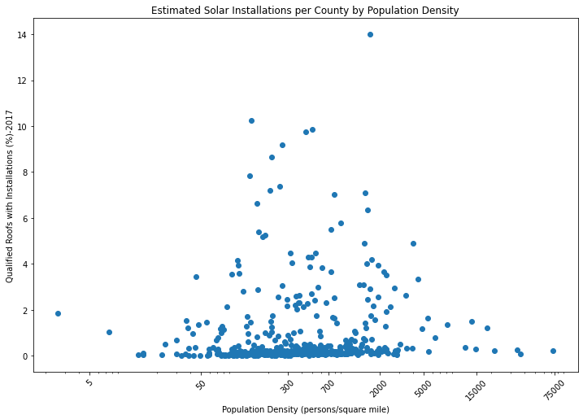
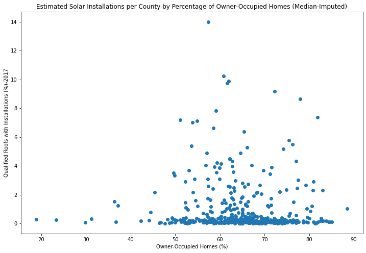

# Solar Energy Adoption by County in the US
## A basic exploration and analysis using Google Project Sunroof and US Census data

### Background

This project explores adoption of solar energy in the US using publicly-available data.

The first aim is to examine the relationship between solar energy adoption and demographics. The specific variables analyzed, and the rationale for their selection, are:
- Per-capita income: is solar a luxury, installed mostly in high-income areas?
- Population density: is solar more prominent in urban areas, perhaps associated with a more progressive population, or in rural areas, where the conventional grid may be less reliable or self-reliance more important?
- Homeowner status: homeowners would have the ability to add solar panels that might be prohibited by renters' landlords or not an option in large multi-unit apartment buildings.

The second aim is to identify the areas with the largest and smallest growth (based on change in percentage of qualified roofs with installations) for 2021 versus 2017. This might give insight into which regions could be targeted for increased marketing of solar, or which might be more receptive to political initiatives promoting renewable energy.

The primary data source was county-level data on solar suitability from [Google Project Sunroof](https://www.google.com/get/sunroof/data-explorer/). The 2021 data were obtained directly from that site, while 2017 data were obtained from [Kaggle](https://www.kaggle.com/jboysen/google-project-sunroof).

County-level US census data were used to obtain per-capita income, population density, and homeowner status. Income and population came from [this Kaggle source](https://www.kaggle.com/muonneutrino/us-census-demographic-data), while land area was obtained from [this Census bureau page](https://www.census.gov/library/publications/2011/compendia/usa-counties-2011.html#LND) and homeowner status from [this one](https://data.census.gov/cedsci/table?q=tenure&tid=ACSDP1Y2019.DP04&hidePreview=false).

County-level data were selected to provide more granularity than state data, as well as (hopefully) some degree of homogeneity in demographics, governmental structure, and geography. City- and census-tract-level data were also available, but I chose to exclude the former as it would not include rural/unincorporated areas, and the latter as they were likely to be too small to reveal discernible trends.  

### Data Files
The final merged, cleaned dataset is `solar_final.csv`.
The file `meta.csv` gives a description of each column and its source.

The final data were processed from these raw files (some renamed for convenience from the original downloads):
- `projsunrf_cty_2017.csv`: 2017 county-level Project Sunroof data
- `projsunrf_cty_2021.csv`: 2021 county-level Project Sunroof data
- `acs2017_county_data.csv`: 2017 county-level US Census population & per-capita income data
- `LND01.csv`: 2010 county-level US Census data on land area
- `hsg_tenure.csv`: 2019 county-level US Census data on households (including owner-occupancy)

The Python code used for cleaning and merging the data, and for the exploratory and final analyses, is in the Jupyter notebook `DSND_Proj1.ipynb`

### Methods
Only counties with at least 50% of their Google Maps-identified roofs analyzed by Project Sunroof in both 2017 and 2021 were retained in the dataset. This group was further limited to counties with data available in the three census files for per-capita income, population density, and home ownership.

Univariate distributions of the variables were explored with histograms. Univariate relationships between each independent variable (per-capita income, population density, and home ownership) and the dependent variable (percentage of eligible roofs with installations) was explored with Pearson correlation coefficients and scatter plots.

Since the census data were from 2017 (income, population) and 2019 (home ownership), the 2017 solar installation data were selected as the dependent variable.

Solar energy adoption was estimated by calculating the percentage of solar-qualified homes (by [Project Sunroof criteria](https://www.google.com/get/sunroof/data-explorer/)) estimated to have solar installed.

Linear regression was used to explore the multivariate relationship between the three independent variables and the dependent variable. Independent variables were normalized. Data were split randomly into training (70%) test (30%) sets. Regression was performed using [scikit-learn](https://sciki-learn.org). Adequacy of fit was assessed by the R-squared value.

Finally, the 10 counties with the highest and the 10 with the lowest percent change in installations from 2017 to 2021 were extracted and plotted.

### Results
Project Sunroof had data from 909 counties for 2017, and from 1032 for 2021. Of these, 481 had >= 50% coverage for both years.

The census data for income and population covered 3220 counties, the land area data 3198, and the housing-tenure data 840.

The final merged dataset with complete data for all fields included 447 counties from 48 states.

The percentage of qualified roofs estimated to have solar installations ranged from 0.0% to 14.0%, with a median and interquartile range of 0.2% [0.1%, 0.7%] in 2017. The 2021 data were similar: range 0.0% to 13.4%, median & interquartile range 0.2% [0.1%, 0.6%].

#### Question 1: Is per-capita income associated with increased solar adoption?

The correlation between per-capita income and percentage of eligible roofs estimated to have solar installed was 0.25. The plot shows a weak, slightly linear relationship, influenced by a few points at higher income levels.

#### Question 2: Is population density associated with increased solar adoption?

The correlation between population density and percentage of eligible roofs estimated to have solar installed was -0.01. The plot was heavily right-skewed on a linear scale, so what's shown below is logarithmic. There is a peak at moderate population densities, but most of the data are clustered around the lowest adoption rates.

#### Question 3: Is home ownership associated with increased solar adoption?

The correlation between percentage of owner-occupied homes and percentage of eligible roofs estimated to have solar installed was -0.06. While there does seem to be an association of lower solar adoption with lower prevalence of home ownership (< 30%), the bulk of the data are heavily scattered, similar to those for population density.

#### Multivariate Analysis

A multivariate linear regression model using the above demographic variables to predict percentage of homes with solar installations yielded an R-squared value of -0.054 for the test dataset (135 counties). This indicates the demographic variables chosen have essentially no utility for predicting solar adoption. This is not surprising given the weak correlations and lack of clear linear relationships observed in the univariate analyses above.

#### Question 4: Which counties showed the most and least growth in solar adoption?

The Project Sunroof data showed very modest changes from 2017 to 2021 in the percentage of eligible roofs estimated to have solar installations. The median and interquartile range for the difference in percentages was -0.02% [-0.1%, -0.01%]. Of the top 10 counties, only two showed increased installation prevalence, and the maximum value was 0.12%. The bottom 10 counties showed changes ranging from -0.7% to -1.5%. Arkansas had the most counties (2) in the top 10, while Florida had the most (4) in the bottom 10.

It is possible the decline in installation prevalence could be due to Project Sunroof having data available on more homes in 2021. However, for the counties analyzed, the median and interquartile range for change in percent of Google Maps coverage from 2017 to 2021 was actually negative: -5.0% [-12.3%, -1.3%].

Another possibility might be that more houses are being deemed solar-qualified by Google's algorithm. This did seem to be the case: the median and interquartile range for percent change in number of qualified roofs from 2017 to 2021 was 10.7% [7.3%, 19.5%]. However, when this variable was plotted against the change in percentage of roofs estimated to have installations, there was only a very weak trend.

### Discussion and Conclusions

This analysis did not show a clear relationship between the selected demographic variables (per-capita income, population density, and home ownership) and the percentage of solar-qualified homes estimated to have solar installations by Google Project Sunroof.

This may have been due to the low prevalence of solar installations identified (median 0.2% of qualified roofs) making it hard to clearly define a relationship. It is also possible that other variables, such as state or local incentives (e.g., tax credits and availability of net metering), zoning or homeowner association restrictions, and availability of solar installers and maintainers could have a larger influence than demographics. These variables were not captured in the dataset and would be appropriate subjects for further analysis.

Additionally, the data may not be an adequate or representative sample. The data cover 447 counties in 48 states, out of 3220 counties in the 2017 Census data. Only counties with at least 50% of their Google Maps data included in Project Sunroof were included. This may bias the data toward areas where Google was more easily able, or more motivated, to collect aerial footage and to analyze it via Project Sunroof.

Furthermore, it is possible that Project Sunroof is not accurately estimating the number of installations. According to the [methodology](https://www.google.com/get/sunroof/data-explorer/data-explorer-methodology.pdf), installations are estimated by a machine-learning algorithm which was trained on human-labeled images of roofs. They admit that this approach is limited by the paucity of imagery of solar installations available. No data are provided on the accuracy of the algorithm, or any effort to validate it, e.g. with sales data from solar panel installers.

The analysis of growth in solar adoption using 2021 versus 2017 data showed very little change in the percentage of solar-eligible roofs estimated to have solar installations. In fact, most of the data showed no change or a slight decrease. A decrease in installations due to their removal is unlikely, as good-quality solar panels can last 25-30 years. [Solar energy industry data](https://www.seia.org/solar-industry-research-data) also indicate a steady rise in residential installations between 2017 and 2021. However, the latter data indicate total residential installations in the 2000-3000 homes/year range for that period, representing a very small percentage of homes. Additionally, the accuracy of these numbers depends on the machine-learning algorithm used to identify solar installations, whose accuracy, as discussed above, is unknown.

In summary, this analysis was unable to identify a relationship between the studied demographic variables and solar adoption for selected US counties. Other explanatory variables may wield heavier influence. Estimating growth in solar adoption using the Project Sunroof data showed almost no increase in installations as a percentage of roofs identified as eligible. Multiple limitations in the data collection methodology may explain these findings, and further study is warranted.

### Dependencies
`numpy : 1.19.1`  
`pandas : 1.1.3`  
`matplotlib: 3.3.1`  
`seaborn: 0.11.0`  
`scikit-learn: 0.24.1`  
Developed & tested in `Python 3.8.5`

#### History
Created March 25, 2021

#### License  
[Licensed](license.md) under the [MIT License](https://spdx.org/licenses/MIT.html). Yours to do with what you will.
